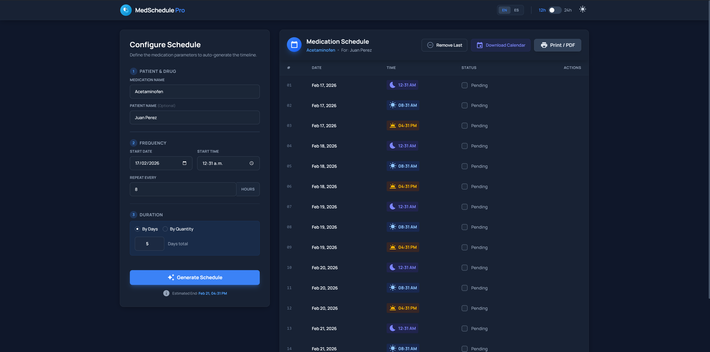

# MedSchedule Pro 💊


A modern, production-ready web application for generating, tracking, and exporting medication schedules. Designed with a focus on usability, accessibility, and clean aesthetics.



## ✨ Features

- **📅 Smart Scheduling**: Calculate doses by duration (days) or fixed quantity.
- **💊 Dose Tracking**: Mark doses as taken with interactive checkboxes and progress tracking.
- **📄 PDF Export**: Generate professional, printable schedules in 1 or 2-column layouts.
- **📆 Calendar Integration**: Export directly to Google Calendar, Outlook, or .ics files.
- **🌙 Dark/Light Theme**: First-class dark mode support with system preference detection.
- **🌍 Internationalization**: Fully localized in English and Spanish.
- **⏰ Flexible Time Formats**: Toggle seamlessly between 12h/24h time display.
- **🎨 Modern UI**: Built with Glassmorphism design principles, smooth animations, and responsive layout.

## 🚀 Quick Start

### Prerequisites

- **Node.js** 24.x
- **pnpm** 10.x
- **Docker** (optional)

### Installation

```bash
# Clone the repository
git clone https://github.com/diegoxdc99/MedSchedule.git

# Install dependencies
pnpm install

# Start the development server
pnpm dev
```

Visit `http://localhost:5173` to see the app in action.

## 🐳 Docker Deployment

You can run MedSchedule instantly using Docker:

```bash
# Using Docker Compose (Recommended)
docker-compose up -d

# Or using Docker Run
docker run -p 3000:80 diegoxdc99/medschedule:latest
```

Access the app at `http://localhost:3000`.

## 🛠️ Tech Stack

Built with a cutting-edge stack for performance and developer experience:

| Category | Technology |
| :--- | :--- |
| **Framework** | React 19 + TypeScript 5.9 |
| **Bundler** | Vite 7 |
| **Styling** | TailwindCSS 4 |
| **State** | Zustand 5 |
| **i18n** | i18next |
| **Dates** | date-fns 4 |
| **PDF** | jsPDF + jspdf-autotable |
| **Testing** | Vitest + React Testing Library |
| **Container** | Docker + Nginx |

## 🧪 Testing

We ensure reliability with a comprehensive test suite:

```bash
# Run all unit and integration tests
pnpm test

# Run tests in watch mode for development
pnpm test:watch

# Generate coverage report
pnpm test:coverage
```

## 📁 Project Structure

```bash
src/
├── components/         # Reusable React UI components
├── store/              # Global state management (Zustand)
├── utils/              # Business logic, date helpers, and PDF generation
├── i18n/               # Localization files (en/es)
├── __tests__/          # Unit and Component tests
└── test/               # Test configuration and setup
```

## 📄 License

This project is licensed under the MIT License - see the [LICENSE](LICENSE) file for details.
